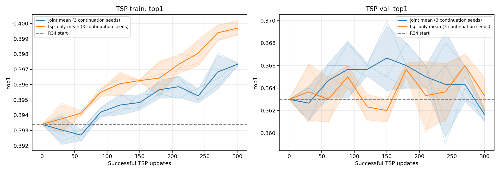
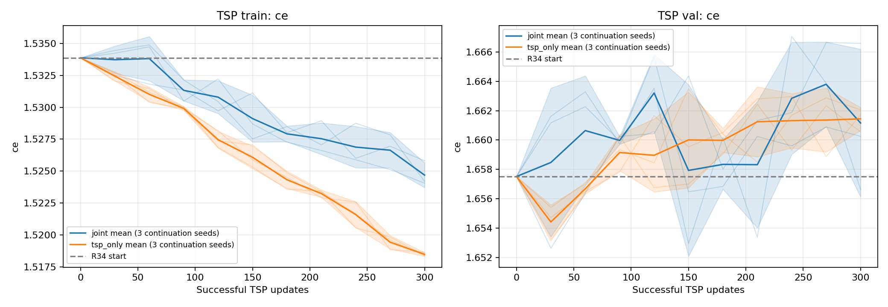
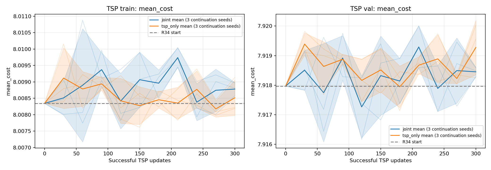

# R35: TSP joint / single-task continuation

## 结论与下一步

六组实验已全部完成。本轮结果更接近计划中的第二种情况：**TSP 单任务续训能稍微改善训练集拟合，但没有带来持续的验证集收益。当前证据不足以认定多任务共享是 TSP 效果的主要瓶颈，暂不据此增加 Adapter。**

- 第300次 TSP 更新：单任务的平均 train top1 为39.9700%，联合为39.7333%，提高0.2367个百分点；val top1 分别为36.3333%和36.1667%，提高0.1667个百分点。
- 起点 R34 的 val top1 为36.3000%。单任务 endpoint 平均仅比起点高0.0333个百分点，不能把相对联合组的差异理解成相对 R34 的明显进步。
- 最后5个评估点：单任务 / 联合的 train top1 为39.8187% / 39.6193%，单任务在三个 seed 中都略好；val top1 为36.4400% / 36.4267%，平均仅差0.0133个百分点。
- last5 的逐 seed 验证 top1 差异为 +0.08、+0.10、-0.14个百分点，没有一致优势。
- last5 的验证 CE：单任务1.66107，联合1.66089；验证 mean cost：单任务7.91860，联合7.91845。单任务没有同时改善验证 CE 和成本。
- 两组的训练 CE 都缓慢下降，但验证 CE 围绕起点波动并略有上升。该曲线不支持仅靠继续增加这一配方的训练轮数取得大幅泛化提升。

下一步优先检查**实例表征和标签可预测性**：按实例规模、oracle 第一/第二名成本差分桶，观察哪些区域无法区分 winner；再用小训练子集的可拟合性对照，区分优化/表示能力不足与标签信号本身不足。这些是后续建议，本轮没有追加相关实验、Adapter 或 loss 修改。

这个结论仅针对固定 LR=2e-5、300次 TSP 成功更新、从同一已训练 checkpoint 出发的局部续训。不能据此证明从头训练时不存在多任务干扰，也不能证明实例表征或标签噪声已经被确认为原因。

训练/验证数据每次评估分别包含完整10000/1000个实例。132份预测文件重放通过，固定 LR、更新预算、模型源文件和数据哈希检查通过；三对的初始模型/optimizer/scaler、每次 TSP batch 及 dropout 随机流完全一致。详见 [verification.json](verification.json) 和 [result_replay.json](result_replay.json)。

## 实验设置

All runs start from R34 winner-cost best.pt (epoch 50), restoring the same model, optimizer and AMP scaler.
The model, native labels, pools and winner-cost loss are unchanged. LR is fixed at 2e-5 after restoring AdamW.
No test split is loaded. Seeds 2/3/4 are continuation repeats from ONE pretrained checkpoint, not independent training runs.
A complete joint round updates every problem once; evaluation follows the entire round. TSP sampling and dropout streams are paired.

## Endpoint: 300 successful TSP updates

| Mode | Seed | Total updates | Train CE | Train top1 | Train cost | Val CE | Val top1 | Val cost | Val vs_SBS |
| --- | ---: | ---: | ---: | ---: | ---: | ---: | ---: | ---: | ---: |
| R34 start | - | 0 | 1.53387 | 39.34% | 8.008346 | 1.65752 | 36.30% | 7.917969 | -0.5006% |
| joint | 2 | 5400 | 1.52420 | 39.72% | 8.008970 | 1.65665 | 36.20% | 7.918590 | -0.4928% |
| joint | 3 | 5400 | 1.52406 | 39.74% | 8.008567 | 1.66025 | 36.10% | 7.918280 | -0.4966% |
| joint | 4 | 5400 | 1.52581 | 39.74% | 8.008808 | 1.66658 | 36.20% | 7.918487 | -0.4941% |
| tsp_only | 2 | 300 | 1.51840 | 39.96% | 8.008219 | 1.66056 | 36.50% | 7.918245 | -0.4971% |
| tsp_only | 3 | 300 | 1.51841 | 40.02% | 8.008192 | 1.66205 | 36.30% | 7.919558 | -0.4806% |
| tsp_only | 4 | 300 | 1.51866 | 39.93% | 8.009137 | 1.66172 | 36.20% | 7.920026 | -0.4747% |

## Three-seed aggregates

Mean +/- sample SD across continuation seeds. last5 is the arithmetic mean at TSP updates 180, 210, 240, 270, 300.

| Window | Split | Mode | CE | top1 | mean_cost | vs_SBS |
| --- | --- | --- | ---: | ---: | ---: | ---: |
| endpoint | train | joint | 1.52469 +/- 0.00097 | 39.73333 +/- 0.01155% | 8.00878 +/- 0.00020 | -0.49084 +/- 0.00252% |
| endpoint | train | tsp_only | 1.51849 +/- 0.00015 | 39.97000 +/- 0.04583% | 8.00852 +/- 0.00054 | -0.49414 +/- 0.00668% |
| endpoint | val | joint | 1.66116 +/- 0.00503 | 36.16667 +/- 0.05774% | 7.91845 +/- 0.00016 | -0.49449 +/- 0.00198% |
| endpoint | val | tsp_only | 1.66144 +/- 0.00078 | 36.33333 +/- 0.15275% | 7.91928 +/- 0.00092 | -0.48413 +/- 0.01160% |
| last5 | train | joint | 1.52673 +/- 0.00082 | 39.61933 +/- 0.04086% | 8.00892 +/- 0.00038 | -0.48910 +/- 0.00467% |
| last5 | train | tsp_only | 1.52142 +/- 0.00022 | 39.81867 +/- 0.05278% | 8.00846 +/- 0.00030 | -0.49490 +/- 0.00379% |
| last5 | val | joint | 1.66089 +/- 0.00176 | 36.42667 +/- 0.09866% | 7.91845 +/- 0.00048 | -0.49446 +/- 0.00601% |
| last5 | val | tsp_only | 1.66107 +/- 0.00032 | 36.44000 +/- 0.03464% | 7.91860 +/- 0.00024 | -0.49259 +/- 0.00305% |

## Paired differences: TSP-only minus joint

Positive top1 and negative cost deltas favor TSP-only. corrected/harmed compare exactly the same instances.

| Seed | Split | top1 delta (pp) | cost delta | Corrected | Harmed | Changed predictions |
| --- | --- | ---: | ---: | ---: | ---: | ---: |
| 2 | train | +0.2400 | -0.000751 | 115 | 91 | 410 |
| 2 | val | +0.3000 | -0.000345 | 8 | 5 | 34 |
| 3 | train | +0.2800 | -0.000375 | 112 | 84 | 358 |
| 3 | val | +0.2000 | +0.001277 | 7 | 5 | 33 |
| 4 | train | +0.1900 | +0.000329 | 153 | 134 | 539 |
| 4 | val | +0.0000 | +0.001539 | 11 | 11 | 60 |

train last5: TSP-only minus joint top1 = +0.1993 pp; cost = -0.000467; top1 improves in 3/3 seeds.

val last5: TSP-only minus joint top1 = +0.0133 pp; cost = +0.000149; top1 improves in 2/3 seeds.

## Scope and interpretation

This probe estimates the effect of interleaved task updates on TSP over 300 TSP updates, not equal-compute performance.
Restored Adam moments are shared; other-task updates can affect parameters and optimizer moments. This is the intended treatment.
Three continuation seeds alone do not establish statistical significance or a conclusion for other tasks.
Use endpoint AND last5 train/val behavior, with cost, to decide whether a later adapter experiment is justified.
Model/optimizer/scaler identity, TSP index and dropout alignment, and complete baseline predictions are checked in verification.json.
W&B records are offline. No adapters, solver feature changes, attention changes or test-based model selection were added.

