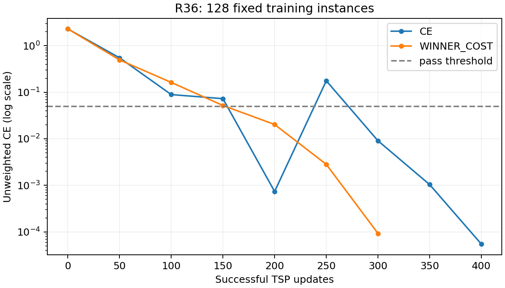
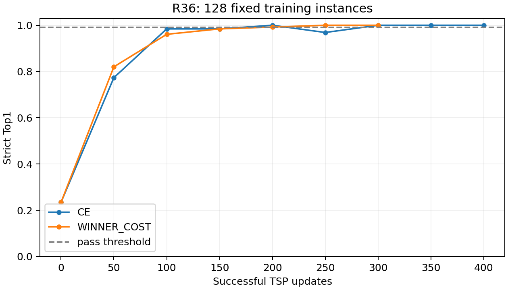

# R36：TSP 错误分布与小样本拟合诊断

## 结论

主基线仍保留 R34。本轮只读 TSP train/val，不读取 test，不修改模型、solver 特征、Q/K/V 或 loss 公式。
两种目标都能拟合固定128例，未发现基本拟合路径失效或 winner-cost 明显阻碍小样本拟合的证据。
全量验证错误并非主要由低代价的近似打平构成；下一步优先做局部几何表征的单因素对照，而非继续盲目加轮数。

## R36A：原始精度错误分析

复用 R35 joint_seed2 的 u000 logits；已验证其源 checkpoint SHA256 对应 R34 best.pt 第50轮。
成本直接由 raw_label.pkl 的 Python float 列表读取为 FP64，未从 FP32 缓存恢复。train/val 的 native winner 均为原始成本最小的方法。
winner gap 为第一、第二名的相对成本差；actual regret 为实际所选方法相对最低成本的损失。严格 Top1 始终按 native ind。
桶的损失占比采用该桶 actual regret 百分值之和除以全部实例之和，不是样本占比或原始成本差之和。

| 数据 | R34 Top1 | 规模先验 Top1 | R34 mean_cost | R34 vs_SBS | 平均实际损失 | 错例中损失≤0.1% |
|---|---:|---:|---:|---:|---:|---:|
| train | 0.3934 | 0.3090 | 8.008346 | -0.4963% | 0.6373% | 13.27% |
| val | 0.3630 | 0.2990 | 7.917969 | -0.5006% | 0.6118% | 13.66% |

### 按真实胜负差距分桶

| 数据 | winner gap | n | 严格 Top1 | 平均 actual regret | 全部损失占比 |
|---|---|---:|---:|---:|---:|
| train | =0 | 184 | 0.2174 | 0.1696% | 0.49% |
| train | (0,0.01%] | 440 | 0.3409 | 0.2951% | 2.04% |
| train | (0.01%,0.1%] | 1632 | 0.3058 | 0.3986% | 10.21% |
| train | (0.1%,0.5%] | 4528 | 0.3777 | 0.5943% | 42.22% |
| train | >0.5% | 3216 | 0.4773 | 0.8926% | 45.04% |
| val | =0 | 16 | 0.1875 | 0.0765% | 0.20% |
| val | (0,0.01%] | 57 | 0.2807 | 0.2215% | 2.06% |
| val | (0.01%,0.1%] | 164 | 0.2866 | 0.3067% | 8.22% |
| val | (0.1%,0.5%] | 474 | 0.3608 | 0.6018% | 46.62% |
| val | >0.5% | 289 | 0.4360 | 0.9081% | 42.90% |

### 按节点规模分桶

边界仅由训练集四分位数确定：161、275、386；验证集复用。

| 数据 | 节点数 | n | 严格 Top1 | 平均 actual regret |
|---|---|---:|---:|---:|
| train | (-inf,161] | 2505 | 0.3649 | 0.4506% |
| train | (161,275] | 2523 | 0.4015 | 0.7902% |
| train | (275,386] | 2492 | 0.4029 | 0.6874% |
| train | (386,inf] | 2480 | 0.4044 | 0.6201% |
| val | (-inf,161] | 266 | 0.3158 | 0.3109% |
| val | (161,275] | 241 | 0.4066 | 0.7195% |
| val | (275,386] | 250 | 0.3600 | 0.7407% |
| val | (386,inf] | 243 | 0.3745 | 0.7019% |

### 规模先验与错误解读

规模规则只用 train native winner 频率拟合：前三桶选 BQ，最大规模桶选 T2T500。val 不参与选择规则。
验证集 R34 Top1=36.3%，规模先验=29.9%，差6.4个百分点；平均 actual regret 为0.6118%与1.4390%。因此完整模型并非只学会规模。
验证集637个错误中，只有87个实际损失≤0.1%，357个损失>0.5%（占错例56.04%）。不能把剩余错误视为无关紧要的近似打平。
winner gap>0.5%的289例中，Top1=43.60%，163例仍选错，贡献42.90%的总损失。winner gap>0.1%的两桶合计贡献89.52%。
另有40个验证例的 winner gap≤0.1%，但模型 actual regret>0.5%，说明第一、第二名接近并不代表模型选错代价小。
这些统计不证明标签噪声或稳定性；确认标签稳定性仍需复跑 solver，目前未做该操作。

## R36B：固定128例拟合

相同 R34 模型权重；fresh AdamW，不恢复旧 moments；LR=2e-4，batch32，dropout/WD/增强/AMP/TF32均关闭，全部原参数保持可训练。
沿用 R34 的梯度裁剪1.0。最多3000次更新，每50次对完整子集用 eval() 评估；连续三次 Top1≥99% 且未加权 CE≤0.05 才停止。
CE=0.35×CE；WC=0.35×CE+0.10×winner_pair+0.02×scaled_cost_risk，cost_scale=0.01。训练成本仍为 R34 的 FP32 口径，报告成本用原始 FP64。
128例每个 winner 类别16例，节点数50～498，四个规模桶分别40/40/24/24例；它是分层诊断集，不代表完整 train/val 的分布。
两组初始模型哈希、u000 logits、预生成的3000步原始实例索引序列一致；各自停止后的实际训练步数可不同。

| 目标 | 完成更新 | 最终 Top1 | 最终未加权 CE | 连续达标评估点 | 判定 |
|---|---:|---:|---:|---|---|
| ce | 400 | 100.00% | 0.00005493 | 300, 350, 400 | 通过 |
| winner_cost | 300 | 100.00% | 0.00009287 | 200, 250, 300 | 通过 |

128例两组都通过，所以未触发32例训练；32例备用索引已保存，属于128例子集，每个 winner 类别4例。不要把备用索引误认为另一组完成的实验。
CE 在200步首次达标、250步出现回落，直到300/350/400步连续达标；WC 在200/250/300步连续达标。不能只按一次最高 Top1 判断收敛。
WC 更早通过只是单个续训种子和单个子集的观察，不足以宣称它普遍更易优化或泛化更好。

### 计算路径与梯度检查

已逐例核对原始坐标、native winner、FP32训练成本、节点数及有效 mask；两个实验的 encoder、solver encoder、joint layers、pool、decoder、score head 参数均有真实更新。
初始第一批的加权梯度范数：CE=2.07082，pair=0.62164，risk=0.06154。CE与pair余弦≈0.9075，与合并辅助项≈0.8781；辅助梯度范数约为CE的30.95%。
该批初始 CE/risk 余弦≈-0.0217，不能推广为全数据的系统性冲突；两组完成时拟合与梯度指标均正常。初始及最终中间表示也并非常量。
CE/WC 分别有199/400和191/300步触发梯度裁剪，仍然通过拟合。因此本轮未发现裁剪阻断基本拟合的证据。

## 下一步建议

1. 保留 R34 为正式基线；R36 是诊断，不将这两个过拟合 checkpoint 用作新的主方法。
2. 优先针对 TSP 做明确局部几何信息的表征对照，例如多尺度 kNN 距离分位数、局部密度/聚簇统计与相对几何关系。一次只改一个因素，保持 solver 编码、Q/K/V 和 winner-cost 目标不变。
3. 新对照除了总体 val Top1/成本，还看 winner gap>0.1%/>0.5% 的 Top1 与实际 regret；检查提升是否来自更可靠识别明显优势的方法。
4. 本轮不支持优先加入多任务 Adapter，不支持把 winner-cost 认定为拟合瓶颈，也不支持因为近似打平而直接更改 native 标签。
小样本记忆成功只排除了部分基本拟合问题，不证明标签具备良好的泛化可预测性，也不能定位到某个特定编码模块。

## 文件与核验

分桶与规模规则：winner_gap_buckets.csv、size_buckets.csv、size_prior_comparison.csv、size_prior_rules.json；逐实例诊断：instances_train.csv / instances_val.csv。
抽样：subset_128_indices.csv / subset_32_indices.csv；各实验目录含 args、history、train.log、updates.jsonl、全部评估预测、last.pt、diagnostics 和 W&B offline 记录。
verification.json 记录输入文件/主模型哈希及成对协议核验；prediction_replay.json 重算所有拟合评估的 CE/Top1/cost 并检查 Adam 实际步数。
首次尝试在 W&B summary 写入时发生接口错误；训练记录保存在相邻 attempt1_wandb_summary 目录。修复后正式两组完整运行，exit_code=0。W&B 未上传云端，记录为 offline。

参考：[Karpathy 的小样本过拟合排查](https://karpathy.github.io/2019/04/25/recipe/)，[随机标签记忆与泛化的区别](https://arxiv.org/abs/1611.03530)。
