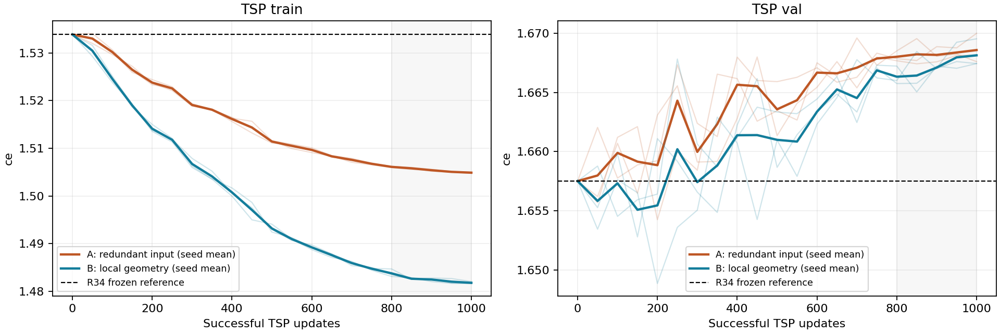
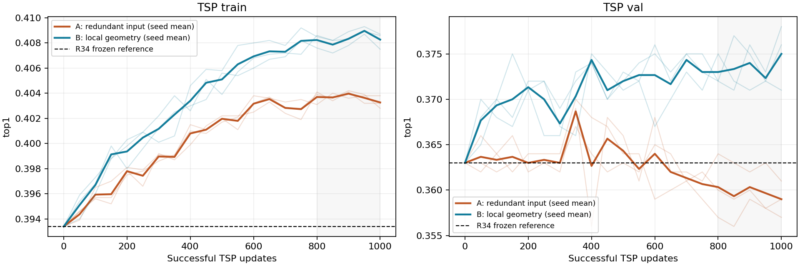
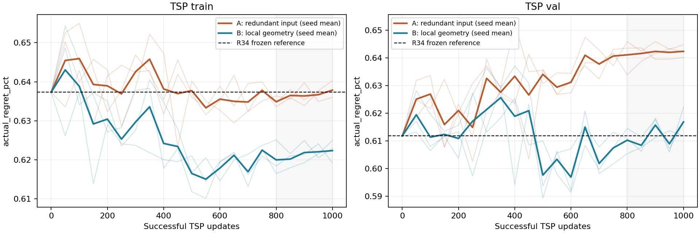
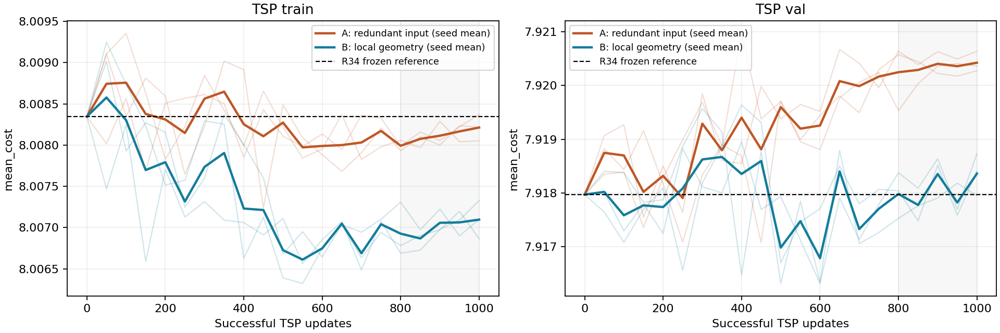
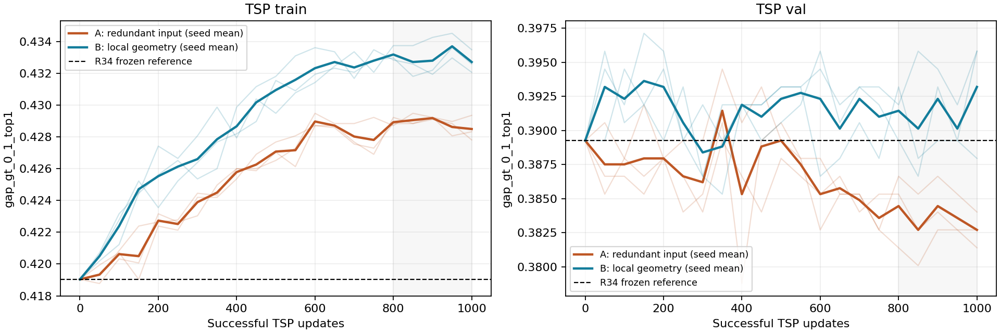
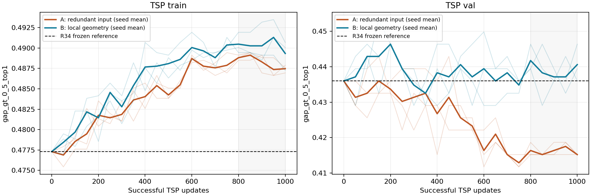

# R37：TSP 多尺度局部几何对照

## 实验范围

R34 仍为18任务主基线。此处只做 TSP train/val 消融，未读取 test，不用 R36 的过拟合权重。
A/B 均从 R34 第50轮 best.pt 出发，加入同一个21→64→128残差 MLP；最后一层零初始化，无额外乘法 gate。
A 使用原8维节点属性、规模、标准化后置零的12维几何；B 使用相同输入中的真实几何。solver 编码、距离 attention bias、双流交互、Decoder 和 winner-cost 目标不变。
每组 seed2/3/4；自然分布采样，batch640，每组1000次成功更新，完整 train/val 每50次评估。两组原模型 dropout 随机流和批次成对一致，AMP跳步重试同一批次。
fresh AdamW，不恢复 moments；原参数 LR=2e-5，新增分支=2e-4，WD=1e-4，原 dropout0.1、新分支无dropout；50步 warmup，之后 cosine 到10%。沿用 R34 AMP/SDPA、梯度裁剪1.0。
这是同一预训练起点的续训重复，不是独立从头训练。主比较为1000步与最后五个评估点（800/850/900/950/1000），不按最高点选择。

## 固定 R34 参考

| Split | CE | Top1 | mean_cost | actual regret | gap>0.1% Top1 | gap>0.5% Top1 |
|---|---:|---:|---:|---:|---:|---:|
| train | 1.533871 | 39.34% | 8.008346 | 0.6373% | 41.90% | 47.73% |
| val | 1.657517 | 36.30% | 7.917969 | 0.6118% | 38.93% | 43.60% |

## 第1000次更新

| 模式 | seed | split | CE | Top1 | mean_cost | actual regret | gap>0.1% Top1 | gap>0.5% Top1 |
|---|---:|---|---:|---:|---:|---:|---:|---:|
| A 冗余输入 | 2 | train | 1.504905 | 40.32% | 8.008216 | 0.6373% | 42.83% | 48.69% |
| A 冗余输入 | 2 | val | 1.668141 | 35.70% | 7.920274 | 0.6402% | 38.14% | 41.52% |
| B 局部几何 | 2 | train | 1.481662 | 40.75% | 8.007098 | 0.6229% | 43.26% | 49.00% |
| B 局部几何 | 2 | val | 1.667438 | 37.10% | 7.918401 | 0.6167% | 38.79% | 43.60% |
| A 冗余输入 | 3 | train | 1.504758 | 40.28% | 8.008370 | 0.6403% | 42.78% | 48.76% |
| A 冗余输入 | 3 | val | 1.667602 | 36.10% | 7.920361 | 0.6423% | 38.40% | 41.52% |
| B 局部几何 | 3 | train | 1.481664 | 40.87% | 8.007329 | 0.6249% | 43.35% | 49.07% |
| B 局部几何 | 3 | val | 1.667439 | 37.80% | 7.918731 | 0.6222% | 39.58% | 44.64% |
| A 冗余输入 | 4 | train | 1.505016 | 40.38% | 8.008052 | 0.6360% | 42.94% | 48.79% |
| A 冗余输入 | 4 | val | 1.669993 | 35.90% | 7.920637 | 0.6448% | 38.27% | 41.52% |
| B 局部几何 | 4 | train | 1.482076 | 40.86% | 8.006864 | 0.6191% | 43.21% | 48.73% |
| B 局部几何 | 4 | val | 1.669530 | 37.60% | 7.917948 | 0.6119% | 39.58% | 43.94% |

### 三种续训 seed 汇总

| 模式 | split | Top1 mean±std | mean_cost mean±std | actual regret mean±std |
|---|---|---:|---:|---:|
| A | train | 40.33%±0.05% | 8.008213±0.000159 | 0.6378±0.0022% |
| A | val | 35.90%±0.20% | 7.920424±0.000189 | 0.6424±0.0023% |
| B | train | 40.83%±0.07% | 8.007097±0.000233 | 0.6223±0.0030% |
| B | val | 37.50%±0.36% | 7.918360±0.000393 | 0.6169±0.0052% |

## 最后五点评估均值

| 模式 | seed | split | CE | Top1 | mean_cost | actual regret | gap>0.1% Top1 | gap>0.5% Top1 |
|---|---:|---|---:|---:|---:|---:|---:|---:|
| A 冗余输入 | 2 | train | 1.505569 | 40.36% | 8.008096 | 0.6356% | 42.87% | 48.79% |
| A 冗余输入 | 2 | val | 1.667788 | 35.74% | 7.920338 | 0.6413% | 38.17% | 41.59% |
| B 局部几何 | 2 | train | 1.482652 | 40.78% | 8.007101 | 0.6230% | 43.26% | 48.99% |
| B 局部几何 | 2 | val | 1.666795 | 37.22% | 7.918005 | 0.6119% | 38.95% | 44.01% |
| A 冗余输入 | 3 | train | 1.505396 | 40.37% | 8.008158 | 0.6372% | 42.87% | 48.87% |
| A 冗余输入 | 3 | val | 1.668392 | 36.26% | 7.920139 | 0.6400% | 38.56% | 41.73% |
| B 局部几何 | 3 | train | 1.482284 | 40.87% | 8.006963 | 0.6200% | 43.40% | 49.22% |
| B 局部几何 | 3 | val | 1.667305 | 37.40% | 7.918305 | 0.6144% | 39.08% | 43.74% |
| A 冗余输入 | 4 | train | 1.505411 | 40.37% | 8.008081 | 0.6365% | 42.92% | 48.80% |
| A 冗余输入 | 4 | val | 1.668634 | 35.92% | 7.920558 | 0.6445% | 38.35% | 41.52% |
| B 局部几何 | 4 | train | 1.482740 | 40.85% | 8.006944 | 0.6208% | 43.25% | 48.89% |
| B 局部几何 | 4 | val | 1.667473 | 37.44% | 7.917865 | 0.6100% | 39.40% | 43.94% |

### 三种续训 seed 汇总

| 模式 | split | Top1 mean±std | mean_cost mean±std | actual regret mean±std |
|---|---|---:|---:|---:|
| A | train | 40.36%±0.00% | 8.008112±0.000041 | 0.6364±0.0008% |
| A | val | 35.97%±0.26% | 7.920345±0.000209 | 0.6419±0.0023% |
| B | train | 40.83%±0.05% | 8.007003±0.000086 | 0.6213±0.0016% |
| B | val | 37.35%±0.12% | 7.918058±0.000225 | 0.6121±0.0022% |

## 成对验证差值：B−A

Top1 单位为百分点；cost/actual regret 越负越好。

| summary | seed | ΔTop1 (pp) | Δmean_cost | Δactual regret (pp) | Δgap>0.1 Top1 (pp) | Δgap>0.5 Top1 (pp) |
|---|---:|---:|---:|---:|---:|---:|
| final | 2 | +1.400 | -0.001873 | -0.0235 | +0.655 | +2.076 |
| last5 | 2 | +1.480 | -0.002333 | -0.0294 | +0.786 | +2.422 |
| final | 3 | +1.700 | -0.001630 | -0.0201 | +1.180 | +3.114 |
| last5 | 3 | +1.140 | -0.001834 | -0.0257 | +0.524 | +2.007 |
| final | 4 | +1.700 | -0.002688 | -0.0329 | +1.311 | +2.422 |
| last5 | 4 | +1.520 | -0.002693 | -0.0345 | +1.048 | +2.422 |

## 判断

相对 A，B 在全部续训 seed 的最终点和末五点均值上，验证 Top1 更高且成本、actual regret 的点估计更低。这是成对方向一致性，不等同于已确认稳定降成本；下方 bootstrap 的成本区间仍需单独检查。
final：平均 ΔTop1=+1.600 pp，Δmean_cost=-0.002064，Δactual regret=-0.0255 pp。
last5：平均 ΔTop1=+1.380 pp，Δmean_cost=-0.002287，Δactual regret=-0.0298 pp。

### 与固定 R34 的区别

B−R34 (final)：Top1=+1.200 pp，mean_cost=+0.000391，actual regret=+0.0051 pp，CE=+0.010619，gap>0.5% Top1=+0.461 pp。
B−R34 (last5)：Top1=+1.053 pp，mean_cost=+0.000089，actual regret=+0.0003 pp，CE=+0.009674，gap>0.5% Top1=+0.300 pp。
不能把修复 A 的续训退化视为同等幅度地超过 R34。B 相对 R34 的成本与 actual regret 没有改善，验证 CE 也未下降；大 gap 桶的 Top1 增益较小。局部几何对匹配对照的 Top1 有增量信号，但仍不足以替换18任务主基线。下一步若继续此方向，应只带回这组特征做18任务受控复验，重点检验成本和高损失桶，不同时叠加更多字段。

### 第1000步的成对实例 bootstrap

对1000个共同验证实例重采样5000次，保留同一实例上的所有续训 seed，并先跨 seed 平均。区间只反映本验证集实例抽样不确定性，不覆盖新的训练 seed、分布偏移或 solver 标签稳定性。
下表 Top1 已转换为百分点；actual regret 也为百分点，mean_cost 保持原始单位。95%区间包含0时不能仅凭单次点估计断言稳定泛化收益。

| 对照 | 指标 | 均值差 | 95%区间 |
|---|---|---:|---|
| B - A | top1 | +1.600000 | [+0.333333, +2.966667] |
| B - A | mean_cost | -0.002064 | [-0.004916, +0.000695] |
| B - A | actual_regret_pct | -0.025506 | [-0.064787, +0.013272] |
| B - R34 | top1 | +1.200000 | [-0.333333, +2.800000] |
| B - R34 | mean_cost | +0.000391 | [-0.002841, +0.003644] |
| B - R34 | actual_regret_pct | +0.005086 | [-0.040270, +0.050334] |

## 曲线

## 精度与实现核验

12维字段及标准化参数见 geometry_stats.json。k=4/8/16，各自为半径、均距、距离CV、包含中心的协方差各向异性。
几何用 FP64 计算，排除自连接/padding，包含 kth 边界上的全部并列邻居；仅 train 有效节点拟合 mean/std，val复用并保存到 checkpoint buffer。
模型与监督隔离：几何只由坐标/mask计算；真实 costs/gap 不进入特征或模型，gap只用于损失及事后分桶。
损失保留 R34 FP32 native-ind 口径；mean_cost、actual regret 和固定 gap 桶直接由 raw_label.pkl 原始 FP64 成本计算。
prediction_replay.json 记录全部评估重算、初始权重/批次/dropout RNG逐更新一致和 Adam 实际步数核验；verification.json 记录代码/输入文件哈希。
checkpoint_replay.json 记录六份最终 checkpoint 在 GPU 上 strict 加载、完整 val 预测重放，以及不提供几何缓存时的在线计算一致性核验。
每个实验目录含 args/history/train.log/last.pt/逐实例预测/update_trace.jsonl。W&B 为 offline 记录，未上传云端。
source_before.tar.gz 是改动前备份；source.tar.gz 是启动时实验源码；source_final.tar.gz 包含最终分析脚本。

参考方向：[PointNet++](https://arxiv.org/abs/1706.02413) 支持研究多尺度局部结构，但本轮是手工几何残差消融，不是复现 PointNet++，论文结果不保证 selector 提升。
