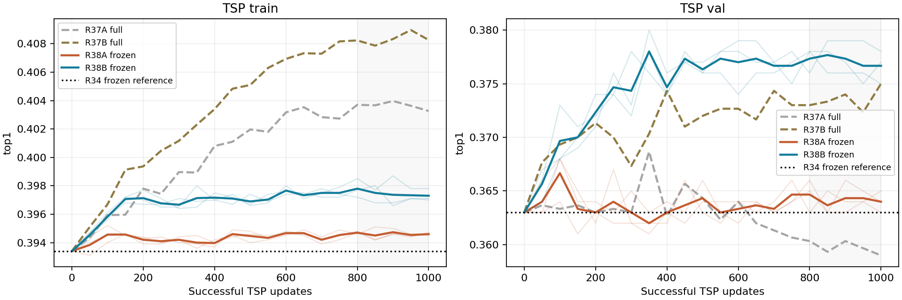
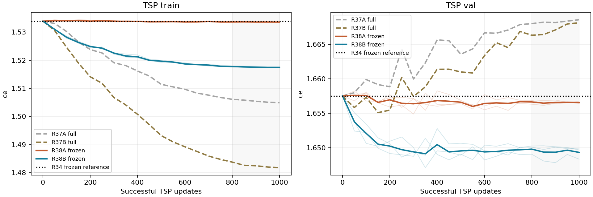
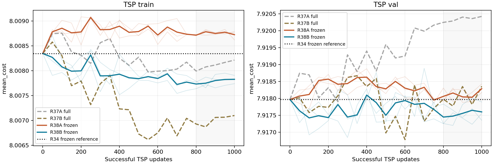
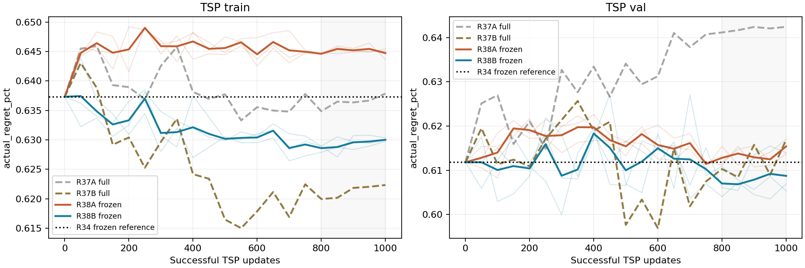
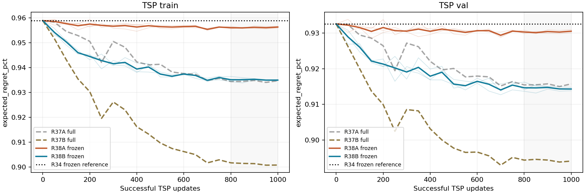
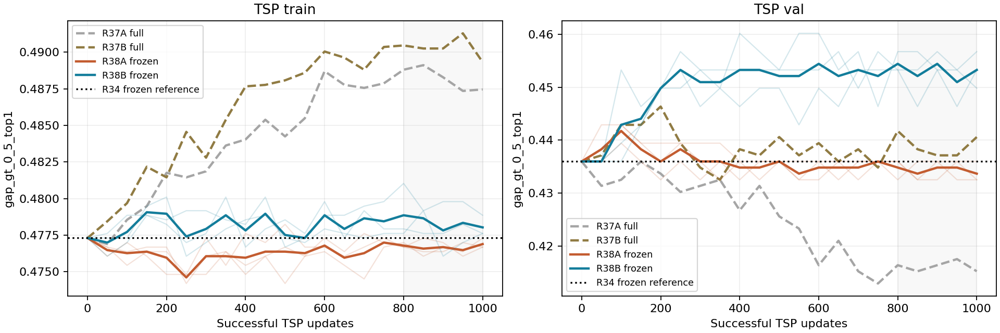

# R38：冻结原模型的 TSP 几何残差对照

R34 仍为18任务主基线；本轮只做 TSP train/val，未读取 test，不从 R37 最终权重继续。
先完成 [R37 成本归因](R37_cost_attribution.md)，再从同一 R34 第50轮 best.pt 跑 R38A/B × seed2/3/4。
R38A 的12维几何标准化后置零；R38B 使用真实几何；原参数全部冻结，仅21→64→128残差 MLP更新。
原网络训练前向未使用 no_grad，保持 train() 的原 dropout0.1，梯度穿过冻结网络回传新分支。eval() 仅用于评估。
其余与 R37 一致：fresh AdamW、分支LR2e-4、WD1e-4、batch640、1000次成功更新、warmup50后cosine至10%、AMP fp16/SDPA、clip1、winner-cost/native ind、关闭增强、自然分布采样。
每50次评估完整 train/val；采用1000步和最后五点（800/850/900/950/1000），不是挑最高点。
同一起点的续训重复，不是三次从头训练。A/B 以及同 seed 同输入的 R37/R38，批次与 dropout随机流逐更新核验一致。

## final：三 seed 均值

| 模型 | split | CE | Top1 | mean_cost | argmax actual regret | softmax expected regret | gap>0.1 Top1 | gap>0.5 Top1 |
|---|---|---:|---:|---:|---:|---:|---:|---:|
| R34 | train | 1.533871 | 39.34% | 8.008346 | 0.637314% | 0.958892% | 41.90% | 47.73% |
| R37A | train | 1.504893 | 40.33% | 8.008213 | 0.637847% | 0.934742% | 42.85% | 48.75% |
| R37B | train | 1.481801 | 40.83% | 8.007097 | 0.622338% | 0.900830% | 43.27% | 48.93% |
| R38A | train | 1.533546 | 39.46% | 8.008724 | 0.644726% | 0.956300% | 42.03% | 47.69% |
| R38B | train | 1.517423 | 39.73% | 8.007826 | 0.630016% | 0.934972% | 42.22% | 47.80% |
| R34 | val | 1.657517 | 36.30% | 7.917969 | 0.611826% | 0.932607% | 38.93% | 43.60% |
| R37A | val | 1.668579 | 35.90% | 7.920424 | 0.642418% | 0.915750% | 38.27% | 41.52% |
| R37B | val | 1.668136 | 37.50% | 7.918360 | 0.616912% | 0.894071% | 39.32% | 44.06% |
| R38A | val | 1.656553 | 36.40% | 7.918291 | 0.615408% | 0.930556% | 38.84% | 43.37% |
| R38B | val | 1.649325 | 37.67% | 7.917604 | 0.608744% | 0.914312% | 39.97% | 45.33% |
## last5：三 seed 均值

| 模型 | split | CE | Top1 | mean_cost | argmax actual regret | softmax expected regret | gap>0.1 Top1 | gap>0.5 Top1 |
|---|---|---:|---:|---:|---:|---:|---:|---:|
| R34 | train | 1.533871 | 39.34% | 8.008346 | 0.637314% | 0.958892% | 41.90% | 47.73% |
| R37A | train | 1.505458 | 40.36% | 8.008112 | 0.636447% | 0.934495% | 42.89% | 48.82% |
| R37B | train | 1.482559 | 40.83% | 8.007003 | 0.621273% | 0.901247% | 43.30% | 49.03% |
| R38A | train | 1.533568 | 39.46% | 8.008749 | 0.645079% | 0.956106% | 42.04% | 47.67% |
| R38B | train | 1.517545 | 39.75% | 8.007786 | 0.629340% | 0.935096% | 42.24% | 47.83% |
| R34 | val | 1.657517 | 36.30% | 7.917969 | 0.611826% | 0.932607% | 38.93% | 43.60% |
| R37A | val | 1.668271 | 35.97% | 7.920345 | 0.641933% | 0.915496% | 38.36% | 41.61% |
| R37B | val | 1.667191 | 37.35% | 7.918058 | 0.612083% | 0.894223% | 39.14% | 43.90% |
| R38A | val | 1.656569 | 36.42% | 7.918120 | 0.613490% | 0.930359% | 38.85% | 43.44% |
| R38B | val | 1.649498 | 37.71% | 7.917549 | 0.607943% | 0.914539% | 40.00% | 45.31% |

## 各 seed 验证结果

| 模型 | seed | summary | Top1 | mean_cost | actual regret | expected regret |
|---|---:|---|---:|---:|---:|---:|
| R38A | 2 | final | 36.40% | 7.918179 | 0.613706% | 0.931026% |
| R38A | 2 | last5 | 36.46% | 7.918039 | 0.612455% | 0.930567% |
| R38B | 2 | final | 37.70% | 7.917897 | 0.613945% | 0.913840% |
| R38B | 2 | last5 | 37.70% | 7.917640 | 0.610894% | 0.913739% |
| R38A | 3 | final | 36.50% | 7.918430 | 0.617040% | 0.930532% |
| R38A | 3 | last5 | 36.42% | 7.918165 | 0.614065% | 0.930345% |
| R38B | 3 | final | 37.80% | 7.917357 | 0.605333% | 0.914315% |
| R38B | 3 | last5 | 37.82% | 7.917597 | 0.607672% | 0.914657% |
| R38A | 4 | final | 36.30% | 7.918265 | 0.615479% | 0.930111% |
| R38A | 4 | last5 | 36.38% | 7.918156 | 0.613949% | 0.930164% |
| R38B | 4 | final | 37.50% | 7.917557 | 0.606955% | 0.914779% |
| R38B | 4 | last5 | 37.62% | 7.917410 | 0.605264% | 0.915223% |

## 成对验证差值：三 seed 均值

Top1单位为百分点，成本/regret越负越好；R38B−R37B直接比较只训练分支与全参数训练。

| 对照 | summary | ΔTop1(pp) | Δmean_cost | Δactual regret(pp) | Δexpected regret(pp) |
|---|---|---:|---:|---:|---:|
| R38B - R38A | final | +1.267 | -0.000688 | -0.006664 | -0.016245 |
| R38B - R34 | final | +1.367 | -0.000366 | -0.003082 | -0.018295 |
| R38B - R37B | final | +0.167 | -0.000757 | -0.008168 | +0.020241 |
| R38A - R37A | final | +0.500 | -0.002133 | -0.027010 | +0.014807 |
| R38B - R38A | last5 | +1.293 | -0.000571 | -0.005547 | -0.015819 |
| R38B - R34 | last5 | +1.413 | -0.000420 | -0.003883 | -0.018067 |
| R38B - R37B | last5 | +0.360 | -0.000509 | -0.004140 | +0.020317 |
| R38A - R37A | last5 | +0.447 | -0.002225 | -0.028443 | +0.014863 |

## R38B−R34 的最终决策成本分解

三 seed 均值；贡献均除以完整验证集1000例，负成本差表示节省。

| 决策变化 | 数量 | 净正确数 | Δmean_cost贡献 | Δactual regret贡献(pp) |
|---|---:|---:|---:|---:|
| 原错→新对 | 27.00 | +27.00 | -0.002142 | -0.027535 |
| 原对→新错 | 13.33 | -13.33 | +0.002024 | +0.027924 |
| 两者都错，换方法 | 39.00 | +0.00 | -0.000248 | -0.003471 |
| 两者都错，未换方法 | 571.00 | +0.00 | +0.000000 | +0.000000 |
| 两者都对，未换方法 | 349.67 | +0.00 | +0.000000 | +0.000000 |

## R36 高损失区域：Top1 与成本一起看

下面两个累计区域相互重叠，不能将样本数或损失贡献相加；分桶仍由原始FP64成本固定。

| 模型 | summary | gap>0.1% Top1 (763例) | gap>0.1% actual regret | gap>0.5% Top1 (289例) | gap>0.5% actual regret |
|---|---|---:|---:|---:|---:|
| R34 | final | 38.93% | 0.717804% | 43.60% | 0.908127% |
| R37B | final | 39.32% | 0.712386% | 44.06% | 0.917426% |
| R38B | final | 39.97% | 0.710582% | 45.33% | 0.928026% |
| R34 | last5 | 38.93% | 0.717804% | 43.60% | 0.908127% |
| R37B | last5 | 39.14% | 0.705951% | 43.90% | 0.905752% |
| R38B | last5 | 40.00% | 0.709810% | 45.31% | 0.925606% |

## 第1000步：成对实例 bootstrap

重采样共同1000个验证实例5000次，保留同一实例上的三个 seed；不把3000个预测当独立样本。只描述本验证集实例抽样不确定性，不覆盖新seed或新分布。
Top1 单位为百分点，regret单位也为百分点；cost为原始单位。负成本差表示改善。

| 对照 | 指标 | 均值差 | 95%区间 |
|---|---|---:|---|
| R38B - R38A | top1 | +1.266667 | [+0.133333, +2.400000] |
| R38B - R38A | mean_cost | -0.000688 | [-0.002765, +0.001373] |
| R38B - R38A | actual_regret_pct | -0.006664 | [-0.036084, +0.022794] |
| R38B - R38A | expected_regret_pct | -0.016245 | [-0.023757, -0.009187] |
| R38B - R34 | top1 | +1.366667 | [+0.200000, +2.566667] |
| R38B - R34 | mean_cost | -0.000366 | [-0.002361, +0.001669] |
| R38B - R34 | actual_regret_pct | -0.003082 | [-0.031649, +0.026831] |
| R38B - R34 | expected_regret_pct | -0.018295 | [-0.025720, -0.011142] |
| R38B - R37B | top1 | +0.166667 | [-1.100000, +1.400000] |
| R38B - R37B | mean_cost | -0.000757 | [-0.003306, +0.001729] |
| R38B - R37B | actual_regret_pct | -0.008168 | [-0.045644, +0.026670] |
| R38B - R37B | expected_regret_pct | +0.020241 | [+0.011946, +0.028796] |

## 判断

尚未同时满足‘R38B 每seed的最终点和末五点成本/regret均低于R34，且最终成本/regret差的95%区间上界小于0’。不能宣布可信超越R34，不立即扩展18任务。
冻结对照区分了原参数更新的影响，但不能自动把所有剩余误差归因于几何不足。softmax期望regret和argmax实际regret分别报告，不能相互替代。

期望regret诊断由原始FP64成本计算且不截断；训练risk沿用R34的FP32、clamp(max=1)与cost_scale，未更改监督目标。

### 具体解读

1. 几何增量仍在：R38B相对冻结冗余输入R38A，最终Top1提高1.267个百分点。相对R34的Top1区间为正，但这只是本验证集上的成对实例bootstrap证据。
2. 冻结改善了验证CE：R38B为1.649325，R37B为1.668136，R34为1.657517。R38A也没有复现R37A明显的验证退化。支持减少整体续训造成的泛化损害，而非否定几何特征。
3. 新改错数量由R37B平均28.67例降为R38B的13.33例；但这些剩余错误仍有较高代价。冻结减少破坏，不等于已解决成本表现。
4. 期望与硬选择没有同步：R38B期望regret为0.914312%，低于R34的0.932607%，但高于R37B的0.894071%。更强的期望成本优化不自动产生更好的argmax成本，不能只看risk曲线或直接放大risk权重。
5. R38完成的是冻结对照，不是18任务的新主模型。成本区间仍包含0，继续保留R34；后续优先检查剩余高代价新错误的原方法→新方法和训练样本覆盖，不立即增加几何字段或扩展任务。
6. 最大gap区域仍未解决：gap>0.5%的最终actual regret从R34的0.908127%变为R38B的0.928026%，即使该区域Top1上升，也不能宣称其选择代价改善。这里同样是点估计，不能把小幅正差直接当作确定退步。
本轮没有读取test。反复使用同一验证集的诊断及模型设计过程不由上述bootstrap区间覆盖；不能将此区间当作独立测试收益保证。

## 核验与文件

frozen_verification.json：原参数及buffer前后逐位一致，optimizer只含新分支，R37/R38的初始权重、批次、dropout和LR计划对齐。
prediction_replay.json：全部评估重算和AMP成功更新/Adam步数核验。geometry_stats.json复用R37训练节点的统计，保存为checkpoint buffer。
每实验目录有 args.json、train.log、history.json、last.pt、batch_indices.pt、update_trace.jsonl 和逐实例预测；W&B离线记录。

checkpoint_replay.json：最终checkpoint的GPU重放及在线/缓存几何计算一致性检查。
source_before.tar.gz是修改前备份，source.tar.gz是启动时源码，source_final.tar.gz含最终分析脚本。

